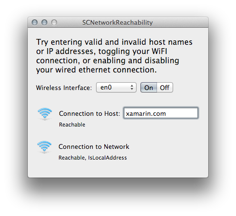

# MonoMac.SystemConfiguration.NetworkReachability

The `NetworkReachability` programming interface allows an application to
determine the status of a system's current network configuration and the
reachability of a target host. A remote host is considered reachable when
a data packet, sent by an application into the network stack, can leave the
local device. Reachability does not guarantee that the data packet will
actually be received by the host.

The `NetworkReachability` programming interface supports a synchronous
and an asynchronous model. In the synchronous model, you get the reachability
status by calling the `TryGetFlags` function. In the asynchronous model, you
can schedule the `NetworkReachability` object on the `CFRunLoop` of a client
object’s thread. The client implements a callback function (`SetNotification`)
to receive notifications when the reachability status of a given remote host
changes.

